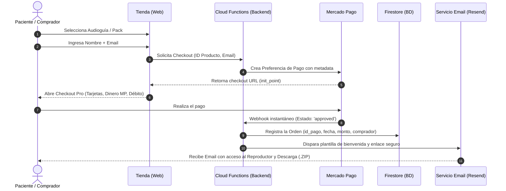

# 🌿 Propuesta de Arquitectura e Implementación: Tienda Digital & Audioguías
**Proyecto:** Psicología Vegana Argentina / Psicólogo Vegano  
**Objetivo:** Automatizar la venta y entrega instantánea de audioguías y recursos digitales terapéuticos con Mercado Pago.

---

## 1. Resumen Ejecutivo y Viabilidad

La infraestructura actual del sitio (**Firebase Hosting + Cloud Functions Node.js + Cloud Firestore**) es la combinación óptima para montar este sistema sin necesidad de contratar plataformas de terceros (como Tiendanube o Shopify), ahorrando costos fijos y manteniendo el 100% de la identidad de marca y control de los datos.

* **Costos fijos de infraestructura:** **$0 USD/mes** (cubierto por la capa gratuita de Firebase y Resend).
* **Comisiones:** Únicamente la comisión estándar por venta cobrada por Mercado Pago.
* **Tiempo estimado de desarrollo e integración:** 1 a 2 jornadas.

---

## 2. Experiencia del Usuario (Flujo de Compra y Entrega)



---

## 3. Modelo de Entrega de Contenido (Audios + PDFs)

Para ofrecer una experiencia de nivel superior y adaptada a celulares y computadoras:

1. **Hub Web Privado del Comprador:**
   * Al pagar, el usuario recibe un link único protegido por token: `psicologiaveganaarg.web.app/recursos/acceso?token=...`
   * **Reproductor Web Integrado:** Permite escuchar los audios sin descargarlos (ideal para escuchar en la cama o en transporte público).
   * **Descargas Individuales:** Botones para bajar cada archivo de audio (.mp3) o cuaderno de ejercicios (.pdf).
   * **Descarga Completa (.ZIP):** Botón para bajar el pack entero en un solo clic.

---

## 4. Gestión y Administración para el Creador (Panel Admin)

En el panel de control existente (`admin.html`), se integran 3 módulos nuevos:

1. **Catálogo de Productos:**
   * Crear nueva audioguía / pack.
   * Subir o vincular portada, audios MP3 y PDFs.
   * Modificar título, descripción, precio y estado (Activo / Pausado).
2. **Registro de Ventas e Ingresos:**
   * Tabla histórica de compras en tiempo real: Fecha, Cliente, Email, Producto, Monto y Estado de entrega.
   * Filtros y exportación a Excel / CSV.
3. **Conexión con Mercado Pago:**
   * Botón de un solo clic **"Vincular mi cuenta de Mercado Pago"** (OAuth) o ingreso seguro de credencial para que el dinero ingrese directo a la cuenta bancaria / MP de Mauro.

---

## 5. Requisitos y Configuraciones Previas

| Componente | Qué se necesita | Acción requerida |
|---|---|---|
| **Mercado Pago** | Cuenta activa de Mauro | Crear una aplicación en [Mercado Pago Developers](https://mercadopago.com.ar/developers) para obtener credenciales o habilitar OAuth. |
| **Firebase Plan** | Plan *Blaze* (Pay-as-you-go) | Habilitar facturación en Google Cloud para permitir que las Cloud Functions consulten APIs externas (Mercado Pago / Emails). *(Costo efectivo: $0 por bajo volumen).* |
| **Servicio de Email** | Cuenta en [Resend.com](https://resend.com) | Generar API Key gratuita (3.000 correos/mes sin costo) y configurar el remitente `hola@psicologiaveganaarg.com` o similar. |
| **Almacenamiento** | Firebase Storage | Crear el bucket para almacenar los audios master protegidos y los archivos PDF. |

---

## 6. Estructura de Base de Datos Propuesta (Firestore)

### Colección `productos`
```json
{
  "id": "audioguia-ansiedad-vegana",
  "titulo": "Gestión de la Ansiedad en un Entorno Especista",
  "subtitulo": "4 Audios Guiados + Cuadernillo Terapéutico en PDF",
  "precio": 12500,
  "moneda": "ARS",
  "activo": true,
  "portadaUrl": "https://storage.../cover.webp",
  "archivos": [
    { "tipo": "audio", "titulo": "01. Introducción y Validación Emocional", "url": "https://storage.../audio1.mp3", "duracion": "14:20" },
    { "tipo": "audio", "titulo": "02. Ejercicio de Regulación Nerviosa", "url": "https://storage.../audio2.mp3", "duracion": "18:45" },
    { "tipo": "pdf", "titulo": "Cuaderno Práctico de Autoobservación", "url": "https://storage.../guia.pdf", "paginas": 12 }
  ],
  "zipUrl": "https://storage.../pack_completo.zip"
}
```

### Colección `ordenes`
```json
{
  "paymentId": "1234567890",
  "email": "comprador@ejemplo.com",
  "nombre": "Lucía Martínez",
  "productoId": "audioguia-ansiedad-vegana",
  "monto": 12500,
  "fecha": "2026-08-20T10:00:00Z",
  "estado": "approved",
  "emailEnviado": true,
  "tokenAcceso": "uuid-secreto-de-acceso"
}
```
